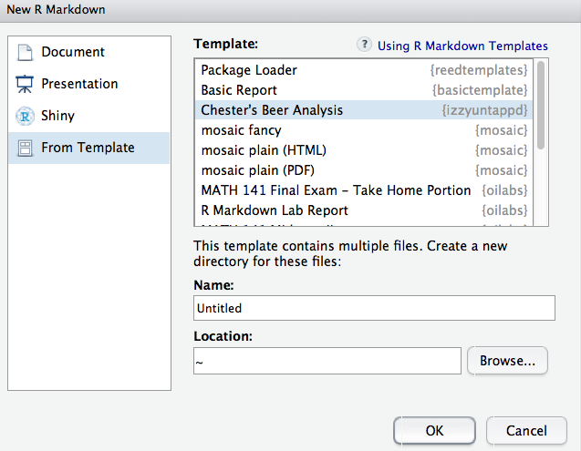

# izzyuntappd

<!--
[](https://travis-ci.org/rudeboybert/resampledata)
[](http://cran.r-project.org/package=resampledata)
-->
 
R package of beer rating datasets corresponding to beer drank and rated by Chester Ismay.


## Installation

<!--
Coming Soon: Get the released version from CRAN:

```R
install.packages("resampledata")
```
-->
 
The development version from GitHub:

```R
# If you haven't installed devtools yet, do so:
# install.packages("devtools")
devtools::install_github("ismayc/izzyuntappd")
```

## Datasets

To see a list of all datasets:

```R
data(package = "izzyuntappd")
```

Currently only one...

## R Markdown template

Some basic analysis on this dataset is available as an R Markdown template.  You can get to this in RStudio via
**File -> New File -> R Markdown -> From Template** and then select **Chester's Beer Analysis** as seen below.

